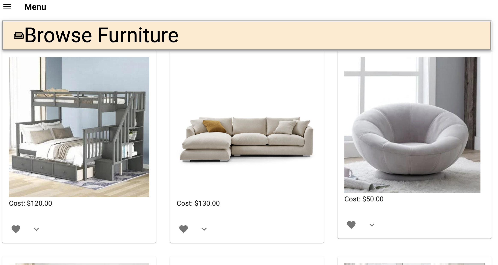
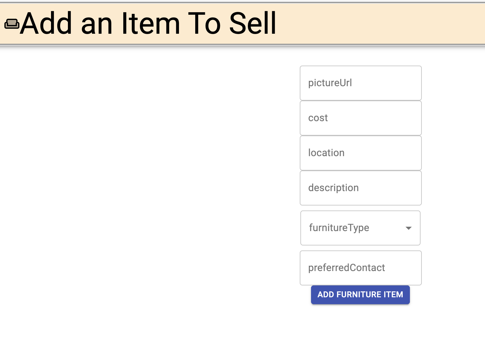
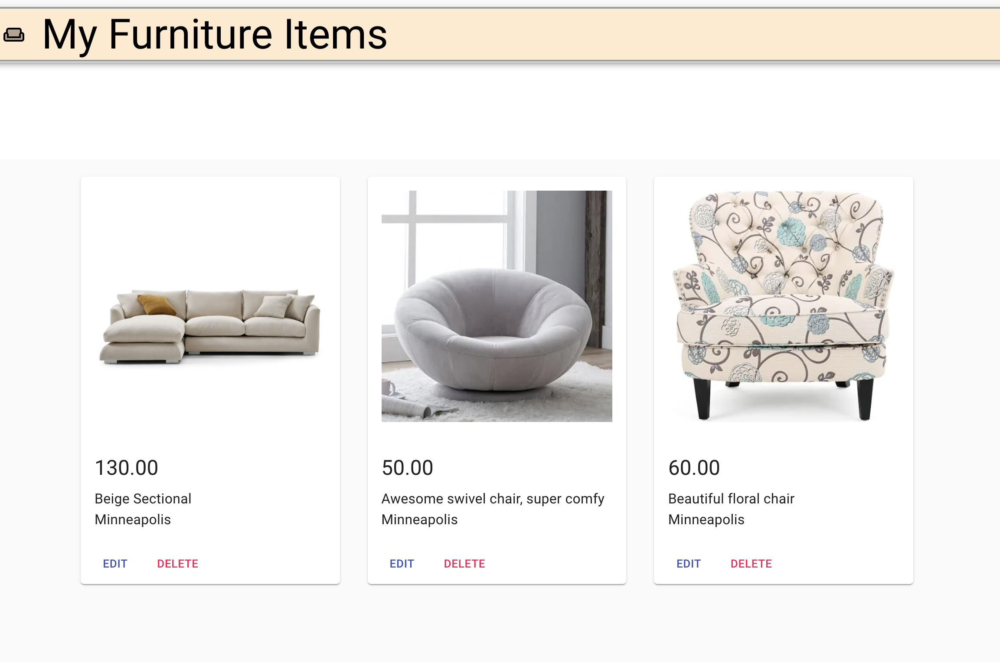
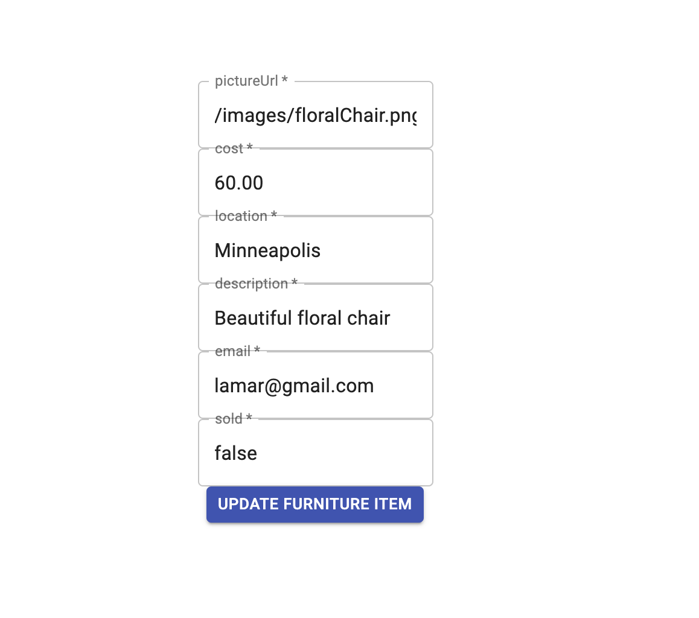
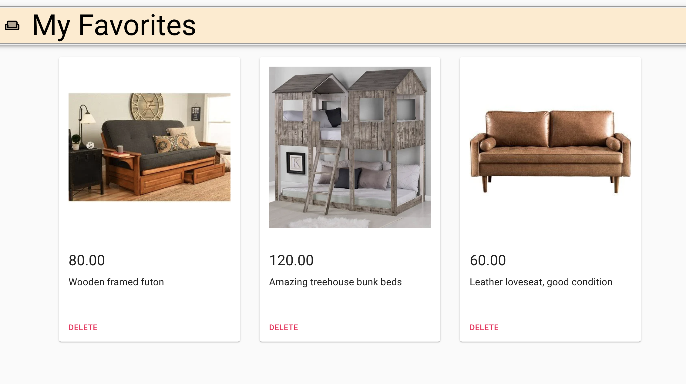

# Furniture Exchange (Solo Project)

## Description

Duration: 2 weeks

This application allows users who are looking to buy or sell furniture a platform on which to do so. Users will log into the app and be given options to browse available items, add an item of their own, update or delete one of their items or favorite one they are interested in.

On the Browse Furniture page users will see cards with various items. These cards have a heart icon in which they can click to mark it as a favorite. There is also a down arrow icon to expand the card showing even more information about that particular item.

When a user is ready to sell an item of their own they'll navigate to the Sell Furniture Form. The form is pretty easy to fill out and once they click 'Add Furniture Item' their item gets added effortlessly and the user is then navigated back to the Browse Furniture page.

If the user decides they want to change something about an item they've added they can navigate to the View My Items page. On this view the user clicks on either the delete button to completely remove it from the browser and the database or the edit button. The edit button pulls up another page where the current information is already prefilled and the user can update the fields they want.

There is a View My Favorites page so users can see the items they marked as favorited earlier. This view also gives the user an opportunity to delete it from their list if they change their mind. If the selling user deletes the item it is automatically removed from any other users view, including the favorites page.

The Info page informs the user of the technologies used to create this app.

## Installation

1. Clone this repository and open in VS Code (or your preferred code editor)
1. Run 'npm install' to retreive all the dependencies
1. Create the database in Postico, or another database
   i. Name the database "furniture-exchange" or make the necessary changes in the server/modules/pool.js file
   i. Create the tables as they are in the database.sql file
1. Open two terminal windows:
   i. Run 'npm run server' in the first one
   i. Run 'npm run client' in the second

## Usage

1. The user begins by clicking the 'Register Here' link and filling out the input fields and creating an account
1. Once the user has created that account they are automatically brought to th 'Home" page.
1. The user then can click on the 'Menu' button on the top left and choose where to navigate to.

## Built With:

- HTML
- CSS
- Material UI
- JavaScript
- React.js
- Redux-saga
- Redux
- Node.js
- JSON
- Express
- Passport
- Postico
- PostgreSQL
- SQL

## Acknowledgement

I would like to thank my family and friends for their love and support throughout this journey. I'd also like to thank the Prime staff, especially Mary Mosman for sharing her wealth of knowledge with me. Lastly, I'd like to thanks my fellow cohortmates for all of their help and encouragement over the last four months.

## Deployment

1. Create a new Heroku project
1. Link the Heroku project to the project GitHub Repo
1. Create an Heroku Postgres database
1. Connect to the Heroku Postgres database from Postico
1. Create the necessary tables
1. Add an environment variable for `SERVER_SESSION_SECRET` with a nice random string for security
1. In the deploy section, select manual deploy

## Update Documentation

Customize this ReadMe and the code comments in this project to read less like a starter repo and more like a project. Here is an example: https://gist.github.com/PurpleBooth/109311bb0361f32d87a2
